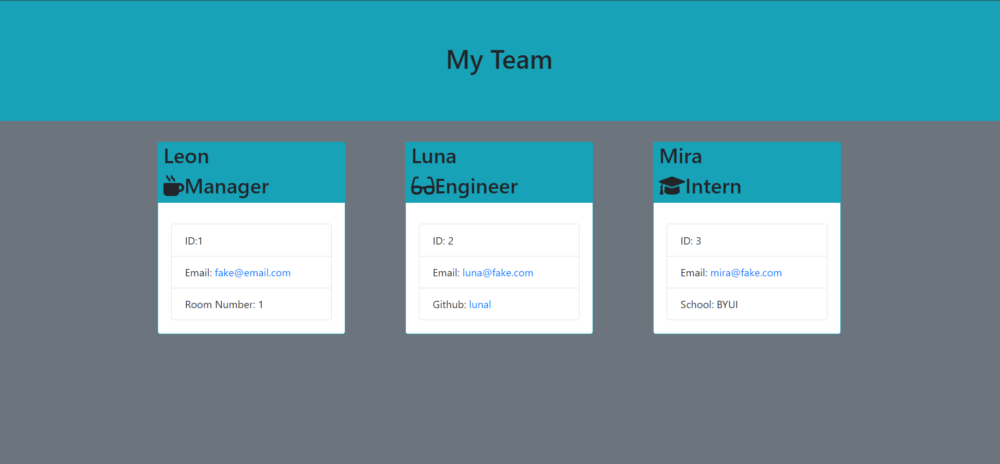

# Whosit

## Description

A combination of Jest and Inquirer, Whosit was made to allow employers to create a roster of their employees.
It was made using Javascript, jest, Inquirer, and HTML/CSS. 

## Usage

To use this program, clone to a local file and run npm install to get the packages needed. Then run node index and the application
will start up. Questions will be asked about the team leader then the user is prompted to add an Engineer or an Intern or finish roster.
if an Engineer or Intern are selected, the user is prompted to answer questions about them before again being prompted with the same question
to select a new employee or finish. Upon finishing, an html page is generated and the css page is copied from src to dist. Upon launching the website,
a roster will show employee information.

## Tests

Jest was used to test this application

## Video

